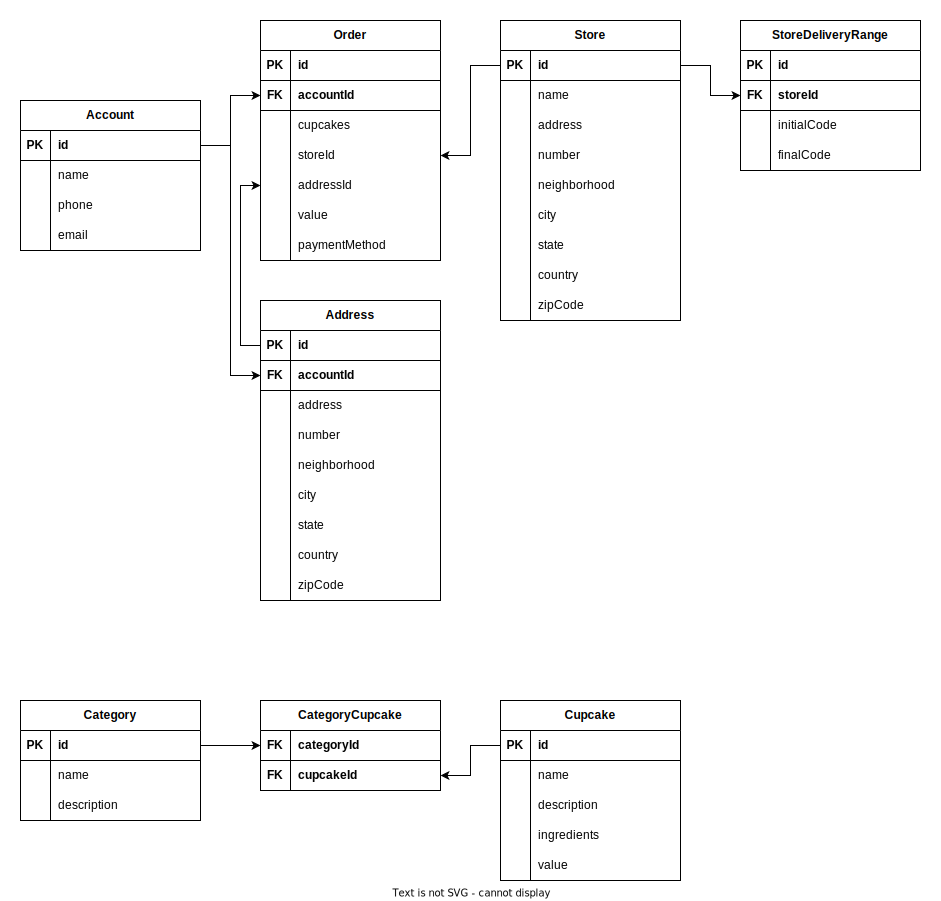
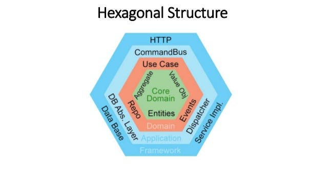
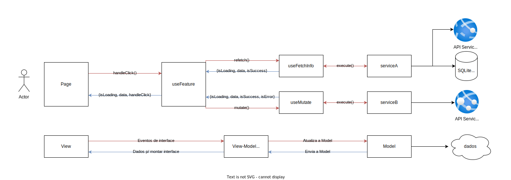

# PIT II

Atividade elaborada para a disciplina Projeto Integrador Transdisciplinar em Engenharia de Software II

> Acompanhe o [CHANGELOG](./CHANGELOG.md)

## Conteúdo

- [PIT II](#pit-ii)
  - [Conteúdo](#conteúdo)
  - [Objetivo](#objetivo)
  - [Features](#features)
    - [Features Backend:](#features-backend)
    - [Features Frontend:](#features-frontend)
  - [Dados](#dados)
    - [Postgres](#postgres)
    - [Diagrama de Relação de Entidade](#diagrama-de-relação-de-entidade)
      - [Dados do Cliente (Conta e Endereço)](#dados-do-cliente-conta-e-endereço)
      - [Lojas (Loja e Range de CEP atendido)](#lojas-loja-e-range-de-cep-atendido)
      - [Cupcakes e Categorias](#cupcakes-e-categorias)
      - [Pedidos](#pedidos)
    - [Prisma](#prisma)
  - [Backend](#backend)
    - [NestJS](#nestjs)
    - [Hexagonal? DDD?](#hexagonal-ddd)
    - [Módulos](#módulos)
  - [Frontend](#frontend)
    - [NextJS](#nextjs)
    - [MVVM](#mvvm)
    - [E a Pratica?](#e-a-pratica)
  - [Infra - CI/CD](#infra---cicd)
    - [Github - Actions - Docker Hub](#github---actions---docker-hub)
    - [AWS - EC2 e S3](#aws---ec2-e-s3)

## Objetivo

O objetivo deste projeto é colocar em prática o projeto desenvolvido durante o PIT I, o exercício proposto é construir um e-commerce de cupcakes gourmet.

## Features

> Lista de features proposta no projeto.

### Features Backend:

- [x] CRUD - Cliente
- [x] CRUD - Endereço do cliente
- [x] Listar cupcakes
- [ ] Criar/Editar/Deletar cupcakes
- [x] Listar Categorias
- [ ] Criar/Editar/Deletar Categorias
- [x] Criar/Listar Pedidos
- [x] Listar Estabelecimentos endereço
- [x] Listar Estabelecimentos por área de atendimento
- [ ] Criar/Editar/Deletar Estabelecimentos
- [ ] Vínculo Estoque(cupcakes)-Estabelecimento Estabelecimentos

### Features Frontend:

- [x] Home - Landing Page com a exibição de ofertas, cupcakes e categorias
- [x] Listar categorias
- [x] Listar cupcakes de uma categoria
- [x] Login (buscar conta por email)
- [x] Criar usuário
- [x] Auto-completar endereço
- [x] Cadastrar endereço
- [x] Resumo do usuário / loggout
- [x] Carrinho (adicionar/remover item, limpar carrinho, realizar compra
- [x] Lojas por região do usuário
- [x] Listar pedidos realizados
- [ ] Múltiplos endereços (listar, cadastrar novo, trocar de endereço favorito)
- [ ] Repetir pedidos
- [ ] Listar todas lojas e permitir usuário escolher
- [ ] Simular escolha de método de pagamento

## Dados

### Postgres

Para a camada de persistência de dados decidimos utilizar um banco relaciona, o banco escolhido foi o PostgresSQL, a escolha se deu pela manutenção e escalabilidade dos bancos relacionais ser mais fácil a manutenção mais robusta do que nos bancos não relacionais.

### Diagrama de Relação de Entidade

#### Dados do Cliente (Conta e Endereço)

As entidades do sistema foi pensando nos apps mais comuns de delivery, geralmente a gente tem os dados do usuário, ele pode ter mais de um endereço de entrega como casa, trabalho e etc.

#### Lojas (Loja e Range de CEP atendido)

Aqui a ideia foi implementar uma lógica simples de range de entregas das lojas, eu copiei um pouco da lógica de outros cases onde eu ja implementei essa logística de atendimento por região, nos _Seeds_ eu coloquei uma loja atendendo cada estado realizar os testes, mas dá para entender um pouco da lógica por traz disso.
Uma segunda parte que não cheguei nem a diagramar porque iria precisar mais tempo de desenvolvimento era uma tabela relacionando Loja<>Cupcakes de forma que eu tivesse um estoque básico por loja, e os cupcakes no front seriam exibidos de acordo com a disponibilidade para a região escolhida.

#### Cupcakes e Categorias

Aqui eu tentei manter bem simples, só os dados necessários para mostrar para o cliente as informações necessárias para ele escolher quais produtos ele vai comprar.

#### Pedidos

A junção de tudo, uma tabela que relaciona os items (cupcakes) com o endereço de entrega do cliente e a loja que realizaria o atendimento.

> **Todos os dados usado nas Seeds de produtos e categorias foram criados utilizando o ChatGPT, então as descrições, sabores e ingredientes são fictícios.**

### Prisma

Apesar de ser um ORM escolhido para trabalhar no backend, eu acho bacana comentar aqui que escolhi este ORM para experimentar e achei bem legal como ele abstraí para o desenvolvedor a parte do versionamento do banco, apenas realizamos as alterações nos schemas e ele gera as migrations, eu ja usei outros ORMs que tinham esse sync do banco mas esse gera as migrations para a gente acompanhar quando e porque alguma mudança foi realizada.

## Backend

> [https://pit2-api.nubling.dev/api](https://pit2-api.nubling.dev/api)

### NestJS

NestJS tem sido o principal framework de desenvolvimento que eu tenho utilizado profissionalmente. Eu até pensei em utilizar uma linguagem/framework fora da minha zona de conforto, mas dado a escassez de tempo acabei optando pelo mais seguro que eu sabia que iria conseguir entregar o projeto à tempo.
Eu venho utilizando NestJS pela sua ampla adaptabilidade, o framework vem com abstrações construídas para criar quase todo tipo de arquitetura que podemos pensas e comunicações variadas.

### Hexagonal? DDD?

Eu particularmente venho utilizando desde metade de 2022 uma arquitetura que segue alguns padrões da arquitetura hexagonal e DDD mas sem todas abstrações que os padrões estabelecem, a explicação é que hoje em dia com o padrão de micro-serviços a gente vem construindo cada vez serviços mais enxutos, e uma das principais características dos micro-serviços é para ser a fácil substituição de um serviço enxuto por um novo.
Com essa premissa em mente nós utilizamos dos padrões do hexagonal mas acoplado ao NestJS (sim, ferindo o principio da inversão de dependência quando a dependência é o framework escolhido), isso facilita o entendimento de pessoas que estão tendo o primeiro contato com o código porque o código segue um padrão só sem todas aquelas interfaces, abstrações e classes genéricas. As classes são implementações concretas, você abre o código de uma classe de um service(use-case) sendo usado em algum comando e esse service faz exatamente o que ele se propõe a fazer.
Muitas dessas decisões foram tomadas com base na simplicidade que o NestJS nos dá para realizar os testes de unidade, com o NestJS é muito fácil substituir uma classe concreta por alguma implementação de Mock para simular comportamentos adversos e facilitar os testes de unidade.

### Módulos

Além de seguir a arquitetura proposta, eu gosto de separar o backend em módulos e tentar fazer os módulos dependerem o mínimo entre si, de forma que quando um módulo crescer demais, seja mais fácil de separar ele em um serviço só dele, ou se a api crescer demais a gente ainda vai ter uma separação mais simples por contexto do que estamos lidando, geralmente os módulos são as próprias entidades, e é normal que elas se relacionem e nessas camadas a gente gosta de mantes as interfaces bem definidas e acordadas.

## Frontend

> [https://pit2.nubling.dev/](https://pit2.nubling.dev/)

### NextJS

Aqui a escolha foi mais por curiosidade mesmo, apesar de eu ter contato com a ferramenta eu nunca fiz uma do zero e tomei as decisões de ponta a ponta. Além da curiosidade, NextJS tem se provado uma ferramenta bem eficiente e tomando cada vez mais espaço, propondo features cada vez mais robustas.

### MVVM

Geralmente em apps mobile e web apps (frontends) eu tento usar o pattern de MVVM de forma que a gente consiga separar a parte visual (componente e estilização), das regras de negócio nos Models (entidades) da aplicação, e dos comportamentos e atualizações a aplicação sofre.
Utilizando o framework base React que tem sua parte reativa bem elaborada, a gente consegue criar custom hooks que são mais fáceis de serem testados e que realizam o bind de dados entre os layers da aplicação, mantendo tudo coeso e desacoplado.

### E a Pratica?

Eu senti um pouco de dificuldade para fazer a implementação, principalmente pelos fatos de ser Server Side Rendering e ter escolhido manter o File-System Based Router, essa maneira de expor os componentes no Next me deixou um pouco perdido, mais para o final da implementação eu ja tinha uma opinião melhor formada de como faria as separações, devido ao tempo eu acabei deixando alguns pontos que eu ainda queria melhorar em aberto. Mas acredito que no geral eu tenha conseguido manter uma linha de raciocínio clara do que eu queria fazer.
Basicamente o problema para mim foi que o Framework trabalha com duas visões dentro do mesmo sistema, uma parte que roda no lado do servidor e outra no client side, eu acabei misturando um pouco do que eu trouxe do hexagonal para o server side e MVVM para o client-side.
Foi interessante abstrair algumas implementações que precisariam ser realizadas no client-side com os métodos built-in do framework de trabalhar com Forms e Server Actions com quase nada de Javascript no lado do client.
Outro ponto interessante de ver foi a otimização que o NextJS faz nos bundles/imagens que serão carregados no cliente, deixando tudo bem leve e prático de trabalhar.

## Infra - CI/CD

### Github - Actions - Docker Hub

> [https://hub.docker.com/repository/docker/nubling/pit2-frontend/general](https://hub.docker.com/repository/docker/nubling/pit2-frontend/general) [https://hub.docker.com/repository/docker/nubling/pit2-backend/general](https://hub.docker.com/repository/docker/nubling/pit2-backend/general)

Para armazenar o código decidi utilizar o github porque é uma plataforma bem conhecida e temos o acesso às actions que facilitam o CI/CD do nosso sistema, como essa é uma parte que sempre me cativa muito, mesmo não sendo um requisito explicito do trabalho eu quis criar as pipelines que geram os Builds das imagens e publicam elas no Docker Hub. O projeto como um todo tem uma carência de testes automatizados, hoje nos meus projetos profissionais eu mantenho um coverage de pelo menos 80% do código, mas mesmo com a falta deles e algumas outras ferramentar automatizadas para qualidade de código como o sonar, eu achei interessante construir essa base de integração continua. Agora para o CD, eu queria configurar o Jenkins para realizar os deployments automaticamente mas como estamos utilizando uma VM com recursos bem limitados acabei decidindo deixar essa parte um pouco manual.

### AWS - EC2 e S3

De infra estamos usando um EC2 com Nginx fazendo reverse-proxy para utilizar os subdomínios e apontar para containers Dockers rodando os projetos Back e Front configurados em um docker-compose, ainda dentro da mesma instância de EC2 estamos rodando uma imagem separada para o banco, no ambiente de produção eu gosto de separar o banco do compose para evitar acidentes.

Além da instancia EC2 estamos utilizando um S3 para guardar os nossos assets utilizados no frontend, esses assets foram criados utilizando inteligência artificial também e não podem ser usadas comercialmente.
